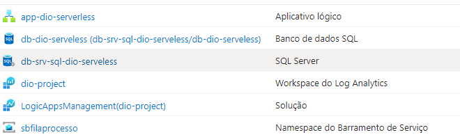

# TRABALHANDO APLICAÇÕES SERVERLESS NA AZURE

## Índice

- [TRABALHANDO APLICAÇÕES SERVERLESS NA AZURE](#trabalhando-aplicações-serverless-na-azure)
  - [Índice](#índice)
  - [Descrição do Projeto](#descrição-do-projeto)
  - [Estrutura do Lab](#estrutura-do-lab)
    - [Parte I: Criar HTTP Trigger e Fila](#parte-i-criar-http-trigger-e-fila)
    - [Parte II: Criar Banco de Dados SQL e Azure Functions](#parte-ii-criar-banco-de-dados-sql-e-azure-functions)
  - [Implementação](#implementação)
    - [Passo a Passo](#passo-a-passo)
    - [Recursos criados](#recursos-criados)
  - [Conclusão](#conclusão)
  - [Referências Bibliográficas](#referências-bibliográficas)

## Descrição do Projeto

Este projeto visa implementar um fluxo de trabalho no Azure que utiliza um HTTP Trigger via Logic Apps e incorpora resiliência na entrega de requisições através de uma fila. A arquitetura inclui duas Azure Functions: uma para ler mensagens da fila e outra para salvar dados em um banco de dados SQL.

    

## Estrutura do Lab

### Parte I: Criar HTTP Trigger e Fila

1. **Criar Grupo de Recursos**
   - Nome: `DIO-SERVERLESS`

2. **Criar Workspaces do Log Analytics**
   - Nome: `dio-project`

3. **Criar Logic App**
   - Nome: `app-dio-serverless`
   - Configurar o HTTP Trigger para receber requisições.

4. **Criar Service Bus**
   - Nome: `sbfilaprocesso`
   - Configurar a fila para garantir a resiliência na entrega das requisições.

### Parte II: Criar Banco de Dados SQL e Azure Functions

1. **Criar Servidor SQL**
   - Nome: `db-srv-sql-dio-serverless`

2. **Criar Banco de Dados SQL**
   - Nome: `db-dio-serverless`
   - Associar ao servidor criado.

3. **Criar Azure Function para Salvar no SQL**
   - Nome: `fn-Salvar-SQL`
   - Implementar a lógica para armazenar dados recebidos na fila no banco de dados.

4. **Criar Azure Function para Ler da Fila**
   - Nome: `fn-LerFila`
   - Implementar a lógica para ler mensagens da fila `sbfilaprocesso`.

## Implementação

### Passo a Passo

1. **Configurar o Ambiente**
   - Assegure-se de ter uma conta no Azure e as permissões necessárias para criar os recursos.

2. **Criar os Recursos Necessários**
   - Utilize o portal do Azure ou a CLI do Azure para criar os recursos conforme descrito nas partes I e II.

3. **Desenvolver as Azure Functions**
   - Utilize C# ou Python para desenvolver as funções, garantindo que a função `fn-LerFila` consuma mensagens da fila e que a função `fn-Salvar-SQL` insira os dados no banco de dados SQL.

4. **Testar o Fluxo de Trabalho**
   - Envie requisições para a Logic App e verifique se as mensagens estão sendo processadas e salvas corretamente no banco de dados.
### Recursos criados
A seguir, os recursos criados no portal da azure.

    

## Conclusão

Este lab fornece uma base sólida para entender como integrar diversos serviços do Azure, garantindo a resiliência e a escalabilidade nas aplicações. Ao final do processo, você terá uma arquitetura funcional que pode ser expandida e adaptada conforme necessário.

[Repositório de referência](https://github.com/hsouzaeduardo/dio-live-function)

## Referências Bibliográficas

- Microsoft Azure. (n.d.). *Logic Apps Documentation*. Retrieved from [Azure Logic Apps](https://docs.microsoft.com/azure/logic-apps/)
- Microsoft Azure. (n.d.). *Azure Functions Documentation*. Retrieved from [Azure Functions](https://docs.microsoft.com/azure/azure-functions/)
- Microsoft Azure. (n.d.). *Azure SQL Database Documentation*. Retrieved from [Azure SQL Database](https://docs.microsoft.com/azure/sql-database/)
- Microsoft Azure. (n.d.). *Azure Service Bus Documentation*. Retrieved from [Azure Service Bus](https://docs.microsoft.com/azure/service-bus/)

